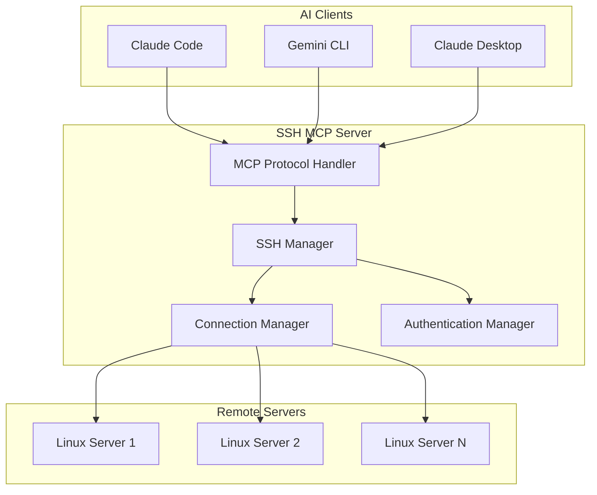
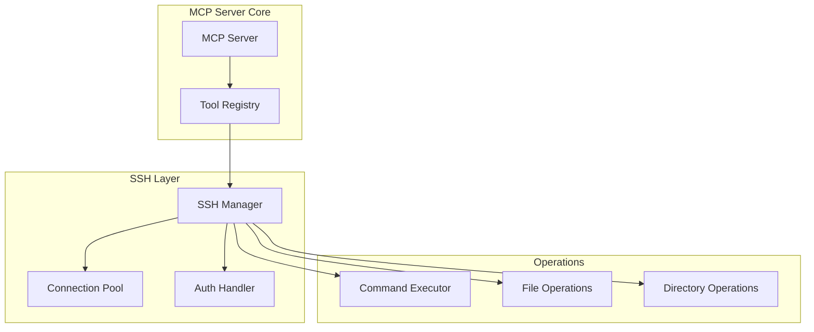

# Design Document

## Overview

SSH MCP 서버는 Model Context Protocol (MCP) 표준을 구현하여 AI 클라이언트들이 SSH를 통해 원격 리눅스 서버와 상호작용할 수 있도록 하는 서버입니다. 이 서버는 Python으로 구현되며, `mcp` 패키지와 `paramiko` SSH 라이브러리를 사용합니다.

## Architecture

### High-Level Architecture



### Component Architecture



## Components and Interfaces

### 1. MCP Server Core

**MCPServer**
- MCP 프로토콜 구현의 메인 클래스
- 클라이언트 요청을 받아 적절한 도구로 라우팅
- JSON-RPC 2.0 메시지 처리

```python
class MCPServer:
    def __init__(self):
        self.ssh_manager = SSHManager()
        self.tools = self._register_tools()
    
    async def handle_request(self, request: dict) -> dict:
        # MCP 요청 처리 로직
        pass
```

**Tool Registry**
- 사용 가능한 SSH 도구들을 등록하고 관리
- 도구 메타데이터와 스키마 정의

### 2. SSH Manager

**SSHManager**
- SSH 연결의 생성, 관리, 종료를 담당
- 여러 연결을 동시에 관리하는 연결 풀 구현

```python
class SSHManager:
    def __init__(self):
        self.connections: Dict[str, SSHConnection] = {}
        self.auth_handler = AuthenticationHandler()
    
    async def create_connection(self, config: SSHConfig) -> str:
        # SSH 연결 생성 및 연결 ID 반환
        pass
    
    async def execute_command(self, connection_id: str, command: str) -> CommandResult:
        # 명령어 실행
        pass
```

**SSHConnection**
- 개별 SSH 연결을 래핑하는 클래스
- paramiko SSHClient를 사용한 실제 SSH 연결 관리

```python
class SSHConnection:
    def __init__(self, client: paramiko.SSHClient, config: SSHConfig):
        self.client = client
        self.config = config
        self.connected = True
    
    async def execute(self, command: str) -> CommandResult:
        # 명령어 실행 로직
        pass
```

### 3. Authentication Manager

**AuthenticationHandler**
- 다양한 SSH 인증 방식 지원
- SSH 키, 패스워드, SSH 에이전트 인증

```python
class AuthenticationHandler:
    def authenticate_with_key(self, client: paramiko.SSHClient, 
                            hostname: str, username: str, key_path: str):
        # SSH 키 기반 인증
        pass
    
    def authenticate_with_password(self, client: paramiko.SSHClient,
                                 hostname: str, username: str, password: str):
        # 패스워드 기반 인증
        pass
```

### 4. MCP Tools

다음 도구들을 MCP 프로토콜을 통해 제공:

**ssh_connect**
- SSH 연결 생성
- 입력: hostname, username, auth_method, credentials
- 출력: connection_id

**ssh_execute**
- 원격 명령어 실행
- 입력: connection_id, command
- 출력: stdout, stderr, exit_code

**ssh_read_file**
- 원격 파일 읽기
- 입력: connection_id, file_path
- 출력: file_content

**ssh_write_file**
- 원격 파일 쓰기
- 입력: connection_id, file_path, content
- 출력: success_status

**ssh_list_directory**
- 디렉토리 목록 조회
- 입력: connection_id, directory_path
- 출력: directory_listing

**ssh_disconnect**
- SSH 연결 종료
- 입력: connection_id
- 출력: success_status

**ssh_list_connections**
- 활성 연결 목록 조회
- 출력: connection_list

## Data Models

### SSHConfig
```python
@dataclass
class SSHConfig:
    hostname: str
    port: int = 22
    username: str
    auth_method: str  # "key", "password", "agent"
    key_path: Optional[str] = None
    password: Optional[str] = None
    timeout: int = 30
```

### CommandResult
```python
@dataclass
class CommandResult:
    stdout: str
    stderr: str
    exit_code: int
    execution_time: float
```

### ConnectionInfo
```python
@dataclass
class ConnectionInfo:
    connection_id: str
    hostname: str
    username: str
    port: int
    connected: bool
    created_at: datetime
    last_used: datetime
```

## Error Handling

### Error Categories

1. **Connection Errors**
   - 네트워크 연결 실패
   - SSH 서버 응답 없음
   - 타임아웃

2. **Authentication Errors**
   - 잘못된 자격 증명
   - SSH 키 파일 없음
   - 권한 거부

3. **Command Execution Errors**
   - 명령어 실행 실패
   - 권한 부족
   - 파일 시스템 오류

4. **MCP Protocol Errors**
   - 잘못된 요청 형식
   - 필수 매개변수 누락
   - 지원하지 않는 도구

### Error Response Format

```python
@dataclass
class MCPError:
    code: int
    message: str
    details: Optional[dict] = None
```

### Error Handling Strategy

- 모든 오류는 구체적이고 실행 가능한 메시지와 함께 반환
- 연결 오류 시 자동 재시도 메커니즘 구현
- 디버그 모드에서 상세한 스택 트레이스 제공
- 보안에 민감한 정보는 오류 메시지에서 제외

## Testing Strategy

### Unit Testing

1. **SSH Manager Tests**
   - 연결 생성/종료 테스트
   - 명령어 실행 테스트
   - 오류 처리 테스트

2. **Authentication Tests**
   - 각 인증 방식별 테스트
   - 인증 실패 시나리오 테스트

3. **MCP Protocol Tests**
   - 도구 등록 및 실행 테스트
   - JSON-RPC 메시지 처리 테스트

### Integration Testing

1. **End-to-End Tests**
   - 실제 SSH 서버와의 연결 테스트
   - 다양한 AI 클라이언트와의 호환성 테스트

2. **Mock Testing**
   - SSH 서버 모킹을 통한 테스트
   - 네트워크 오류 시뮬레이션

### Performance Testing

1. **Connection Pool Testing**
   - 다중 연결 관리 성능 테스트
   - 메모리 사용량 모니터링

2. **Command Execution Testing**
   - 긴 시간 실행되는 명령어 테스트
   - 대용량 파일 전송 테스트

## Security Considerations

### Authentication Security

- SSH 키는 메모리에서만 처리, 디스크에 저장하지 않음
- 패스워드는 즉시 해시화하여 저장
- SSH 에이전트 사용 시 에이전트 소켓 보안 확인

### Connection Security

- SSH 연결은 항상 암호화된 채널 사용
- 호스트 키 검증을 통한 중간자 공격 방지
- 연결 타임아웃 설정으로 좀비 연결 방지

### Data Security

- 민감한 데이터는 로그에 기록하지 않음
- 메모리에서 민감한 정보 즉시 정리
- MCP 클라이언트와의 통신 보안 확인

## Deployment and Configuration

### Installation

```bash
pip install ssh-mcp-server
```

### Configuration

MCP 클라이언트 설정 예시:
```json
{
  "mcpServers": {
    "ssh-server": {
      "command": "python",
      "args": ["-m", "ssh_mcp_server"],
      "env": {
        "SSH_MCP_DEBUG": "false",
        "SSH_MCP_TIMEOUT": "30"
      }
    }
  }
}
```

### Environment Variables

- `SSH_MCP_DEBUG`: 디버그 모드 활성화
- `SSH_MCP_TIMEOUT`: 기본 연결 타임아웃
- `SSH_MCP_MAX_CONNECTIONS`: 최대 동시 연결 수